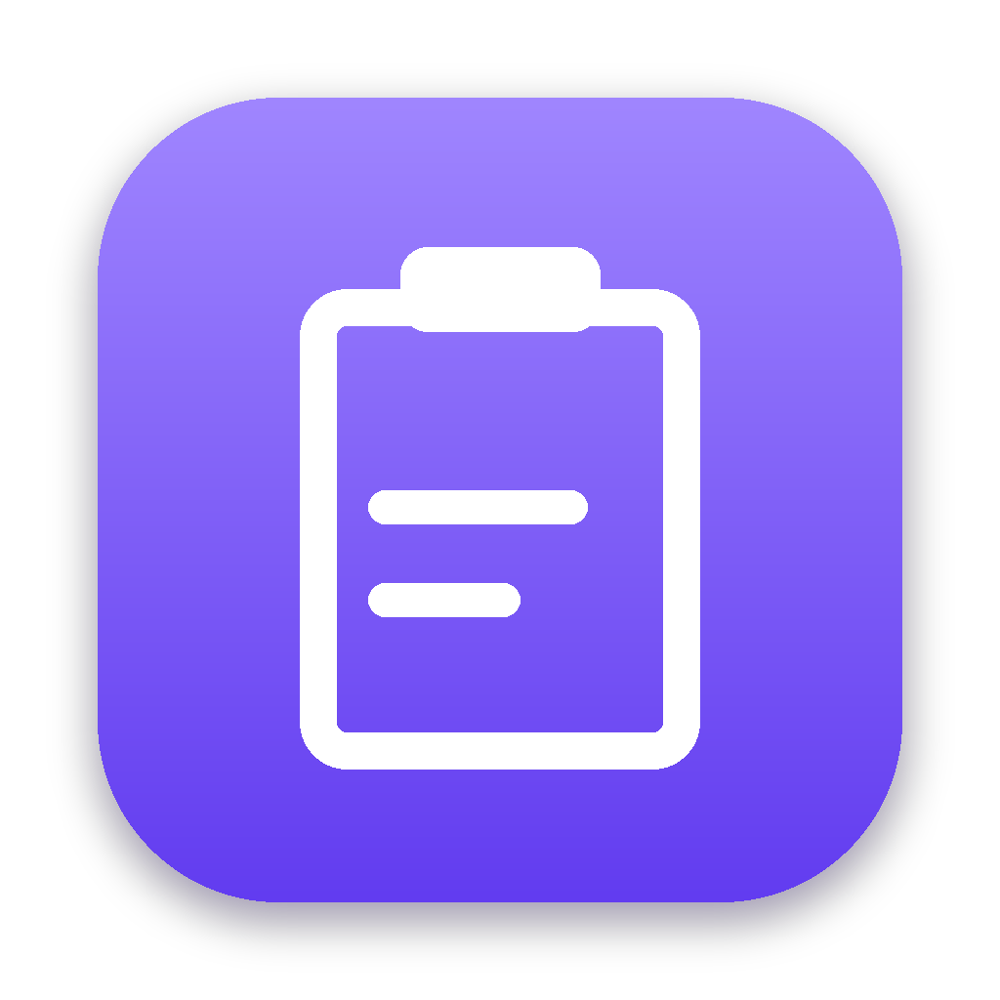
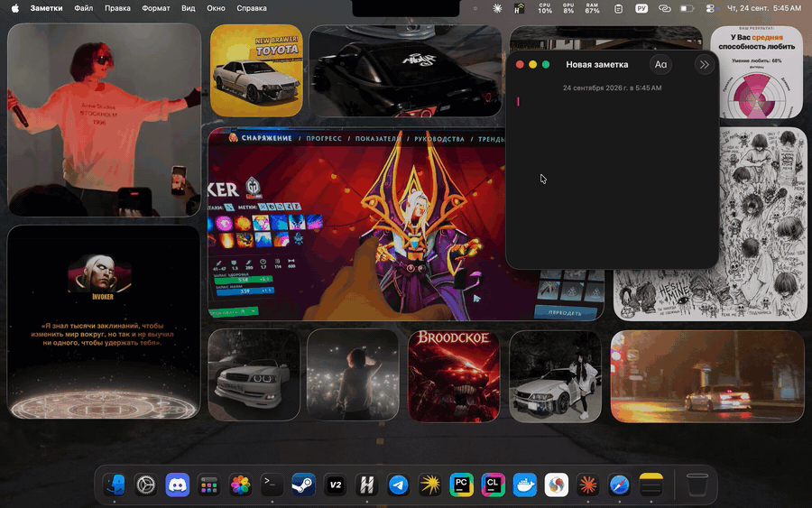

<p align="center">
  
</p>

<h1 align="center">ClipStash</h1>

<p align="center">
  A keyboard-first clipboard manager for macOS, in the spirit of Raycast and Spotlight.<br>
  <b>C++20 · Qt 6 / QML · SQLite · Objective-C++</b>
</p>

<p align="center">
  
</p>

<p align="center"><sub><b>English</b> · <a href="README.ru.md">Русский</a></sub></p>

---

Press <kbd>⌘</kbd><kbd>⇧</kbd><kbd>V</kbd> in any app and a window pops up with everything you've copied: text, links, images, colors and files. Find what you need, hit <kbd>↵</kbd>, and it's pasted right where you were working.

## Features

- **Instant search** across the whole history. Case-insensitive, works with Cyrillic, words match in any order.
- **Automatic type detection**: text, link, image, HEX color (with a swatch preview), files from Finder.
- **Preview pane**: full text, a large color swatch, the image, the link's domain, the file list, plus metadata (source app with its icon, date, size, how many times it was used).
- **Auto-paste** into the active window (<kbd>⌘V</kbd> emulated via the Accessibility API).
- **Pinning** for important items. Pinned items survive clearing and the history limit.
- **Privacy**: passwords from 1Password, Bitwarden and Keychain are never stored ([nspasteboard.org](http://nspasteboard.org) conventions). Recording can be paused.
- **Native look**: frosted-glass window (`NSVisualEffectView`), dark and light themes, works over full-screen apps and on every Space.
- **Lives in the menu bar**: no Dock icon, near-zero resource usage in the background. Optional launch at login.

## Keyboard shortcuts

| Keys | Action |
|---|---|
| <kbd>⌘⇧V</kbd> | open / close (configurable in Settings) |
| <kbd>↑</kbd> <kbd>↓</kbd> | navigate |
| <kbd>↵</kbd> | paste into the active window |
| <kbd>⌘↵</kbd> | copy only |
| <kbd>⌘1</kbd>…<kbd>⌘9</kbd> | quick-paste the Nth item |
| <kbd>⌘P</kbd> | pin / unpin |
| <kbd>⌘⌫</kbd> | delete item |
| <kbd>⌘O</kbd> | open link in the browser |
| <kbd>Tab</kbd> / <kbd>⇧Tab</kbd> | switch filter |
| <kbd>⌘,</kbd> | settings |
| <kbd>Esc</kbd> | clear search / close |

## Architecture

```
src/
├── core/                    # pure logic, no UI or OS → covered by tests
│   ├── ClipItem             # data model, classification, hashing
│   └── ClipStore            # SQLite: schema + migrations, dedup, search, limits
├── app/
│   ├── AppController        # wires together storage, clipboard, OS and QML
│   ├── ClipModel            # QAbstractListModel for the list
│   ├── ClipboardWatcher     # tracks clipboard changes
│   ├── ClipImageProvider    # images and app icons for QML (on worker threads)
│   └── TrayIcon             # menu bar icon
├── platform/
│   ├── Platform.h           # thin OS abstraction
│   ├── Platform_mac.mm      # Objective-C++: Carbon hotkey, CGEvent, NSPasteboard, NSVisualEffectView
│   └── Platform_stub.cpp    # stubs for other platforms
qml/                         # UI: 16 components, design tokens in Theme.qml
tests/                       # Qt Test: storage and classifier
```

Notable decisions:

- **Polling `NSPasteboard.changeCount`** every 350 ms. macOS has no clipboard-change notification, but the counter is extremely cheap: data is only read when it actually changes.
- **Deduplication by SHA-1** of the content with `INSERT … ON CONFLICT(hash) DO UPDATE`. Copying the same thing again bumps the existing item to the top instead of creating a duplicate.
- **Case-insensitive Cyrillic search.** SQLite's `LIKE` only lowercases ASCII, so on insert a separate `search_text` column stores text lowercased with the Unicode-aware `QString::toLower()`.
- **One SQLite connection per thread.** Images are loaded on QML image-loader threads, and `QSqlDatabase` can't be shared across threads.
- **Versioned schema** via `PRAGMA user_version`; the database runs in WAL mode.
- **Source app icons** are rendered from `NSWorkspace` once and cached in the database.
- **Zero image files in the UI**: icons are SVG paths drawn with `QtQuick.Shapes` (CurveRenderer); the menu bar icon is painted with `QPainter` as a template image.

## Building

Requires macOS 12+, Xcode Command Line Tools and Homebrew.

```bash
brew install qt cmake ninja

cmake -S . -B build -G Ninja \
      -DCMAKE_BUILD_TYPE=Release \
      -DCMAKE_PREFIX_PATH="$(brew --prefix qt)"
cmake --build build
ctest --test-dir build --output-on-failure   # tests

open build/ClipStash.app
```

**CLion:** open the project folder, then Settings → Build → CMake → CMake options: `-DCMAKE_PREFIX_PATH=/opt/homebrew/opt/qt`.

### Accessibility permission

Everything works without it except auto-paste — the item is simply copied instead. Grant it in System Settings → Privacy & Security → Accessibility → ClipStash.

> During development every rebuild changes the ad-hoc signature, so macOS may "forget" the permission. Remove ClipStash from the list and add it again, or sign builds with a persistent self-signed certificate.

### Standalone `.dmg`

```bash
./scripts/package.sh            # or: "$(brew --prefix qt)/bin/macdeployqt" build/ClipStash.app -qmldir=qml -dmg
```

## Roadmap

- Snippets with placeholders (`{date}`, `{clipboard}`)
- Sync between Macs via iCloud Drive
- Background PNG encoding (`QtConcurrent`) for huge screenshots

## License

MIT
